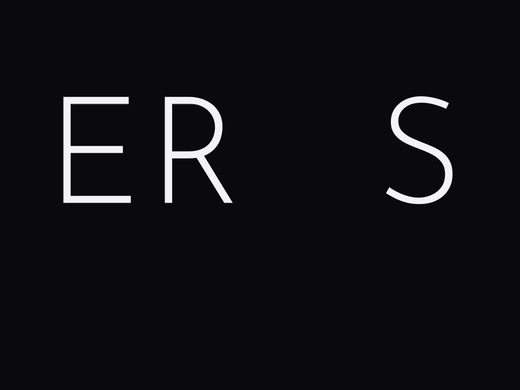

<div align="center">



_A love letter to minimalism._

<a href="releases/latest"></a>

</div>

---

# EROS

A deliberately minimal Cover Flow firmware for the TrimUI
Brick. One single row of cards - your game systems and a music app - and
nothing in the way. No network, no scraping, no settings screens, no chrome.
Turn it on. Play.

> EROS was made for personal use. If you like it too, that's great, but thank
> you in advance for not opening PRs or Issues.

## What it is

- **Cover Flow launcher:** a single perspective-tilted row with reflections.
  Pick a system, drill into its games, pick a game - it launches [minarch] with
  the right core and auto-resumes where you left off.
- **Muse:** a built-in music player that slots in as a card. Browse albums as
  a Cover Flow, drill into tracks, focused now-playing screen. Playback runs in
  a small daemon, so the music keeps playing while you close the app and browse -
  even out to the game shelf.
- **Made to disappear:** a dark monochrome in-game menu - the one bit of chrome
  is a low-battery dot. It's meant to feel like hardware, not software.

## Install

Copy the contents of the release (or `out/sd/` if building from source) onto a
FAT32 SD card, insert it into a stock Brick, and power on. On first boot EROS
installs its boot hook and comes straight up.

## Build

Needs Docker - the tg5040 cross-toolchain runs in a container.

```sh
make                          # -> build/eros.elf   (the launcher)
make -f apps/music/cross.mk   # -> build/muse       (the music player)
minarch/build.sh              # -> vendor/minarch.elf (EROS-restyled, from NextUI source)
mk/fetch-vendor.sh            # pull cores + libs from a NextUI release into vendor/
mk/payload.sh                 # assemble the installable SD payload under out/sd/
```

## On the card

```
/mnt/SDCARD/                          ← FAT32 SD card root
│
├── eros/                             the firmware itself
│   ├── eros.elf  muse  minarch.elf   launch.sh
│   ├── systems.cfg  eros.cfg         ← the only "settings"
│   ├── icons/                        one PNG per card (named in systems.cfg)
│   ├── cores/  lib/                  libretro cores + runtime libs
│   └── EROS-boot.mp4  splash.png     boot animation + splash
│
├── Roms/
│   ├── NES/                          cartridge system → one file per game
│   │   ├── Contra (USA).zip
│   │   └── .media/
│   │       └── Contra (USA).png      ← box art; filename matches the ROM
│   │
│   └── PlayStation/                  disc system → one folder per game
│       ├── Crash Bandicoot/          single disc: just the disc files
│       │   ├── Crash Bandicoot.cue
│       │   └── Crash Bandicoot.bin
│       ├── Final Fantasy IX/         multi-disc: discs + an .m3u inside
│       │   ├── Final Fantasy IX (Disc 1).cue   (+ .bin)
│       │   ├── … Disc 2-4 …
│       │   └── Final Fantasy IX.m3u  ← lists the discs by bare name
│       └── .media/
│           ├── Crash Bandicoot.png   ← named after the folder
│           └── Final Fantasy IX.png
│
├── Music/
│   ├── <Artist>/<Album>/             one folder per album (tag-driven)
│   │   ├── 01 - Track.ogg            WAV / MP3 / FLAC / OGG
│   │   └── cover.png                 ← album art (or folder.jpg)
│   ├── Playlists/                    curated collections
│   │   └── Road Trip/                folder name = label, filename order
│   │       └── 01 first.mp3          cover.png optional; else a branded cover
│   └── loose-track.mp3               files loose in Music/ → a "Singles" bucket
│
├── Bios/                             only the few systems that need one
│   └── PlayStation/
│       └── scph5501.bin              ← you supply it if needed (copyrighted)
│
└── Saves/  .userdata/                save files + states (auto-created)
```

**ROMs** go in any folder you like - map each to a card in `systems.cfg`.
Cartridge systems are one file per game; disc systems (PlayStation, and any
future Saturn / Sega CD) are one **folder per game**, with an `.m3u` inside for
multi-disc titles. **BIOS** is needed only for **PlayStation** (a real
`scph*.bin`) and optionally **GBA** (`gba_bios.bin`) - every other system runs
without one. See [Artwork](#artwork) for box and album art.

Two tiny config files are the whole "settings" surface:

- `systems.cfg` - one line per card: `kind|name|folder-or-exec|core|icon`.
- `eros.cfg` - Bluetooth sink MAC, default volume/brightness, startup card.

WiFi is never brought up; Bluetooth audio auto-connects at boot if configured.

## Artwork

All art is drop-in and warmed at load, so scrolling never hitches on a decode:

- **Game box art** - `Roms/<system>/.media/<rom-name>.png`, where `<rom-name>` is
  the ROM's filename **without the extension**, matched exactly. Multi-disc games
  use the folder name.
- **Album art** - `cover.png` (or `folder.jpg`) inside each
  `Music/<artist>/<album>/` folder. Muse warms the whole album-cover cache on open.
- **System icons** - `eros/icons/*.png`, referenced by `systems.cfg`.

**Sizes.** The panel is 1024×768, so nothing ever draws larger than that - keep the
**longest side ≤ 768px**. Bigger is invisible on-screen and only costs decode time
and memory (it's the difference between a smooth scroll and a first-move stutter):

| Asset | Recommended long side | Format |
|---|---|---|
| Box art / album covers | ~512–768px (a card draws at ~365–515px) | PNG or JPG |
| System icons | 768px | PNG, transparent background |

**Where to get it:**

- *Box art* - [libretro-thumbnails](https://thumbnails.libretro.com/)
  ([repos/packs](https://github.com/libretro-thumbnails)) are named to match
  No-Intro ROM names, so they drop straight into `.media/`.
  [SteamGridDB](https://www.steamgriddb.com) has high-res custom covers;
  [EmuMovies](https://emumovies.com) has curated sets.
- *Album art* - the [Cover Art Archive](https://coverartarchive.org) (MusicBrainz),
  [Discogs](https://www.discogs.com), or whatever's embedded in your files' tags.

## The manual in its entirety

### Cover Flow

- **A** in, **B** out
- **Volume buttons** - volume, any screen
- **Function buttons** - brightness, any screen
- **Power** - power off, any screen

That's the whole grammar - the rest is detail.

### Muse

Albums are a Cover Flow of their own; a chosen album opens as a track list.

- **X** - jump to Now Playing whenever something's playing
- **Now Playing:**
  - **A** - play / pause
  - **Left / Right** - previous / next
  - **L1 / R1** - seek -5s / +5s
  - **X** - cycle modes
  - **Y** - stop
- **MENU** - background Muse and return to Cover Flow

### Bluetooth

Flip the side switch to **BT**. A known headset reconnects on its own; otherwise a
pair screen takes over:

- **X** - scan
- **A** - pair and connect
- **B** - dismiss

It closes itself the moment a device connects. With the switch on BT, audio
routes to the headset - **both Muse and in-game audio** (a game carries the usual
Bluetooth latency; flipping back to the speaker is instant). Once paired, the
headset's own buttons drive Muse: **one press** play/pause, **two** next track,
**three** previous track.

### In a game

EROS uses a slightly modified version of NextUI's [minarch] - **MENU** opens its
in-game menu, and its button mapping lives in that menu's own settings, so you're on
your own in there. Two EROS things hold everywhere: **function buttons** for brightness,
and **Power** powers off (and saves your spot).

## Code

`src/` is a compact SDL2 app: `coverflow.c` (perspective cards + reflections),
`config.c` (two small parsers), `platform.c` (tg5040 display / input / exec),
`main.c` (screens + launch loop). `apps/music/` is Muse (UI, library scan, and
the audio daemon). It's **0BSD** - do whatever you want with it.

## Built with

- **[minarch]** and the libretro cores are built from **NextUI** source
  (GPLv3) and keep their own licenses - cores carry their individual terms
  (note: the bundled `snes9x` core is non-commercial).
- **Muse's** audio decoder dispatch is adapted from **DiscoBoy** (MIT, Utility
  Muffin Research Kitchen); decoding uses the public-domain single-header
  decoders **dr_wav / dr_mp3 / dr_flac** (mackron) and **stb_vorbis**
  (Sean Barrett).
- The menu/logo typeface is **Josefin Sans** (SIL Open Font License).

[minarch]: https://github.com/LoveRetro/NextUI
